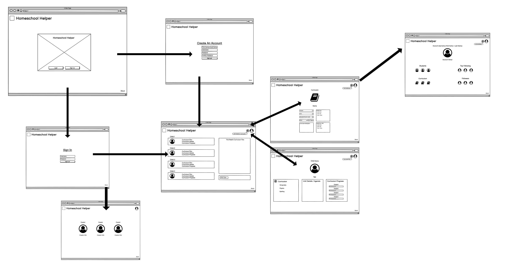
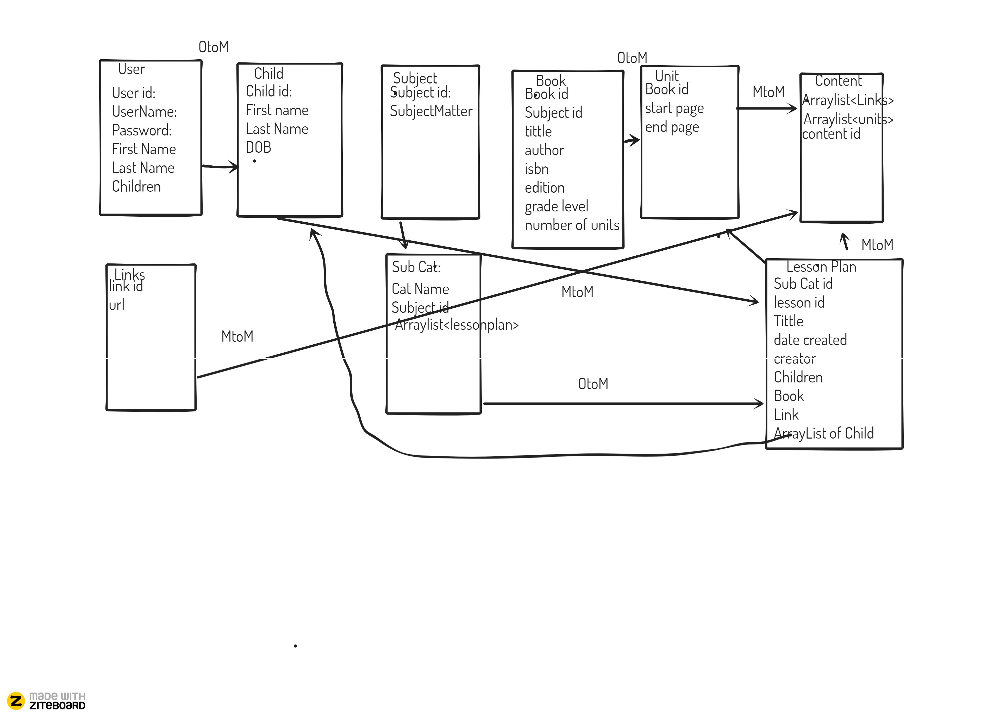
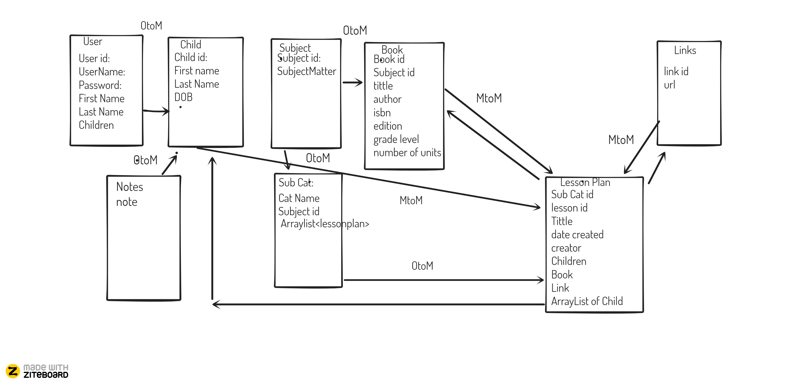

# Homeschool-Helper

## Team Earth: Paul O'Brien, David Dicken and Marchael Acode

**Author**: Paul O'Brien, David Dicken, and Marchael Acode

**Version**: 1.0.0 (increment the patch/fix version number if you make more commits past your first submission)

## Overview

- Due to COVID, many families have chosen to home school their children. This app will be a educational tool to help parents find and create lesson plans for their children and keep track of their educational progress. The Home School Helper app will cut down on stress parents are experiencing while continuously creating lesson plans that are creative enough to engage in their chidlren's academic learning.

## Architecture

- Technologies & languages used: **HTML, CSS, Java (bootstrap and thymeleaf), and just a dash of JavaScript**

## Team Agreement

- [Home School Helper Team Agreement](https://docs.google.com/document/d/1t_uznoQtoUsdYYMaPYRD3wxP9E8v8iTMJpKuSEho_VY/edit?usp=sharing)

## User Stories

1. As a parent I want add all of my children under my account

  - Feature Tasks:
    - Create a user
    - Create a student
    - Link the child to the user
  - Acceptance Tests:
    - Create a child and check that the child was created and linked to the proper user.

2. As a parent I want a way to organize lesson plans

  - Feature Tasks:
    - Create a subject
    - Create a unit
    - Create a lesson plan
    - Organize(link) lesson plans to a unit and link the unit to the corresponding subject.
  - Acceptance Tests:
    - Create a lesson plan/ unit / subject
    - Verify that each was created successfully
    - Link them and verify that they are linked

3. As a parent I want to be able to organize and group my children to the lesson plans that I want them to be on

  - Feature Tasks:
    - Need to create the ability to link a child/children to a subject/unit
  - Acceptance Tests:
    - Create two child objects
    - Create a subject and a unit linked together
    - Link one child to the test unit and verify that they are linked
    - Link the other test child to the same test unit and verify that both children are linked to the same test unit

4. As a child I wanted my parents less time planning homework for me and more time playing with me.

  - Feature Tasks:
    - Assure the ability to create organized lesson plans
  - Acceptance Tests:
    - Create lesson plans/ units/ and subjects. Link them appropriately and test that they have been organized properly.
    - Verify that any api calls return the data that we expect.

5. As a parent I would like to be able to view lesson plans that have been created by other parents.

  - Feature Tasks:
    - Create a page that allows a user to view all other user pages and their lesson plans ( Or a page that can grab and display all lesson plans in the database from a selected subject or unit)
    - Add ability to follow a user that you like the lesson plans they create
    - When viewing a lesson have info on the user that created it and the ability to follow that user
  - Acceptance Tests:
    - As a user create a lesson pan and verify that we are able to view that lesson plan on the lesson plan page

## Software Requirements

- [Home School Helper Software Requirements](https://docs.google.com/document/d/10KfDtbhnkIW5mNqUTe_M7G3J9TzkTgigl-Tjc6MGuBw/edit?usp=sharing)

## Wireframes/Domain Modeling Diagram

## Data Entity Relationship Diagram

## Credits and Collaborations

- Shoutout to Nicolas and Bade for helping with our project whenever we hit road blocks.
